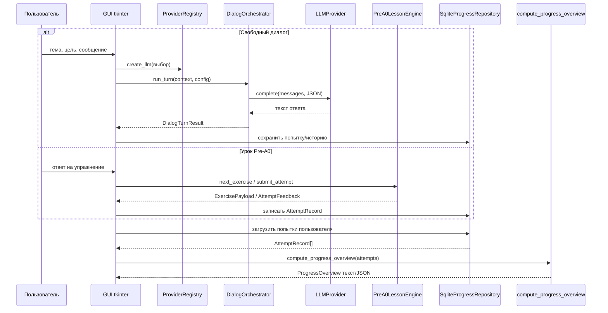

# Логическая схема и архитектура `lang_learn`

Документ фиксирует обзор логики приложения: **блок-схема из символов** (ниже),
краткие пояснения к модулям и диаграммы Mermaid. Актуально на момент генерации
из структуры репозитория `src/lang_learn/`.

## Назначение приложения

Модульное Python-приложение для изучения языка с упором на:

- аудио (TTS/STT);
- структурированный диалог с LLM;
- курс Pre-A0 (алфавит и базовые упражнения);
- travel-сценарии;
- аналитику прогресса;
- GUI на tkinter.

Основная точка входа для сценариев и диагностики — **CLI** (`python -m lang_learn`);
графический интерфейс — окно учебного центра в `gui/desktop_chat.py`.

## Логические модули (блок-схема)

Ниже — прямоугольники из горизонтальных и вертикальных черт; под каждым блоком
кратко указано **назначение**. Стрелки `|` и `v` показывают типичный поток
«сверху вниз» (от пользователя к данным и внешним сервисам). Просматривайте в
режиме моноширинного шрифта.

```text
+-----------------------------+     +-----------------------------+
| Точки входа                 |     | Конфигурация                |
| __main__  cli  gui          |     | config/  dotenv, флаги      |
+-----------------------------+     +-----------------------------+
  Запуск подкоманд; окно tk.          Переменные среды и переключатели
  пользовательский ввод.              поведения без смены кода.

          |                                   |
          +------------------+------------------+
                             v

+-----------------------------+     +-----------------------------+
| contracts/                  |     | schemas/                    |
| протоколы провайдеров,      |     | Pydantic-модели             |
| репозитория, движка урока   |     | запросов, диалога, прогресса|
+-----------------------------+     +-----------------------------+
  Граница «что можно подменить».      Единый формат данных между слоями.

                             |
                             v

+-----------------------------+     +-----------------------------+
| plugins/                    |     | providers/                  |
| реестр имён -> фабрики      |     | stub, HTTP LLM, pyttsx3,    |
| bootstrap                   |     | faster-whisper, …           |
+-----------------------------+     +-----------------------------+
  Сборка приложения: какие      Конкретные бэкенды под интерфейсы
  реализации доступны по ключу. contracts/ (подключаются из GUI/CLI).

                             |
                             v

+-----------------------------+     +-----------------------------+
| learning/                   |     | data/                       |
| Pre-A0, диалог, travel,     |     | JSON: курс, сценарии,       |
| речь, KPI, траектории       |     | траектории                  |
+-----------------------------+     +-----------------------------+
  Правила уроков и диалога без UI.    Статический контент для движков.

          |                    (JSON читает learning/, travel_loader, …)
          +------------------+------------------+
          v                  v
+-----------------------------+     +-----------------------------+
| persistence/                |     | audio_io/ + services/       |
| SQLite-прогресс, пути       |     | микрофон, WAV, TTS/STT-цикл |
+-----------------------------+     +-----------------------------+
  Долговременное хранение попыток.    Захват и воспроизведение; связка
                                      с контрактами STT/TTS.
```

**Смысл разделения (кратко):** GUI и CLI только оркестрируют; контракты
отделяют интерфейс от реализации; `learning/` не зависит от tkinter/SQLite
напрямую в смысле бизнес-правил; репозиторий изолирует БД; схемы стабилизируют
обмен данными.

---

## Схема модулей и зависимостей (архитектура)

В редакторе или на GitHub с поддержкой Mermaid диаграмма отобразится
графически.

```mermaid
flowchart TB
  subgraph entry["Точки входа"]
    MAIN["__main__"]
    CLI["cli.py"]
    GUI["gui/desktop_chat.py\nLearningDesktopApp"]
    MAIN --> CLI
  end

  subgraph config["Конфигурация"]
    ENV["config/dotenv_load\nfeature_flags"]
  end

  subgraph contracts["contracts/ — интерфейсы"]
    LLM_I["LLMProvider"]
    STT_I["STTProvider"]
    TTS_I["TTSProvider"]
    REPO_I["ProgressRepository"]
    LESSON_I["LessonEngine"]
  end

  subgraph plugins["plugins/"]
    REG["ProviderRegistry"]
    LESSREG["LessonEngineRegistry"]
    BOOT["bootstrap.create_default_registry"]
    BOOT --> REG
    BOOT --> LESSREG
  end

  subgraph providers["providers/"]
    STUB_LLM["StubLLMProvider"]
    HTTP_LLM["HttpChatCompletionsLLMProvider"]
    STUB_STT["StubSTTProvider"]
    FW_STT["FasterWhisperSTTProvider"]
    PYTTS["Pyttsx3TTSProvider"]
  end

  REG -.->|create_*| STUB_LLM
  REG -.->|create_*| HTTP_LLM
  REG -.->|create_*| STUB_STT
  REG -.->|create_*| FW_STT
  REG -.->|create_*| PYTTS

  subgraph learning["learning/ — домен"]
    PRE["PreA0LessonEngine"]
    DIAL["DialogOrchestrator"]
    PB["prompt_builder"]
    DP["dialog_parse"]
    TRAV["TravelScenarioService"]
    TRAJ["TrajectoryService"]
    PROG["compute_progress_overview"]
    KPI["kpi_engine / competency / readiness"]
    PRON["pronunciation / speech_quality / shadowing"]
  end

  subgraph persistence["persistence/"]
    SQLITE["SqliteProgressRepository"]
    MEM["memory_progress"]
    PATHS["app_paths"]
  end

  subgraph audio["audio_io/ + services/"]
    REC["recorder / playback / wav_utils"]
    ACY["AudioCycleService"]
  end

  subgraph data["data/ — JSON контент"]
    PA0_JSON["pre_a0/*.json"]
    TRV_JSON["travel/*.json"]
    TRJ_JSON["trajectories/*.json"]
  end

  subgraph schemas["schemas/ — Pydantic"]
    SCH["dialog / learning / audio / progress …"]
  end

  GUI --> BOOT
  GUI --> SQLITE
  GUI --> PATHS
  GUI --> DIAL
  GUI --> PRE
  GUI --> TRAJ

  CLI --> REC
  CLI --> ACY
  CLI --> DIAL
  CLI --> PRE
  CLI --> TRAV
  CLI --> PRON

  DIAL --> LLM_I
  DIAL --> PB
  DIAL --> DP
  DIAL -.->|опционально| TTS_I
  DIAL --> SCH

  PRE --> LESSON_I
  PRE --> PRON
  PRE --> PA0_JSON

  TRAV --> TRV_JSON
  TRAV --> SCH
  TRAJ --> TRJ_JSON

  SQLITE --> REPO_I
  SQLITE --> SCH

  PROG --> KPI
  PROG --> SCH

  ACY --> TTS_I
  ACY --> STT_I
  ACY --> REC

  providers --> LLM_I
  providers --> STT_I
  providers --> TTS_I
```



---

## Схема сценариев (последовательность при действии пользователя в GUI)



---

## Примечание по просмотру диаграмм

Файлы `.md` с блоками `mermaid` удобно открывать в GitHub, GitLab, VS Code/Cursor
с расширением для Mermaid или экспортировать через [Mermaid Live Editor](https://mermaid.live/).

При изменении кода обновляйте этот документ, если меняются границы слоёв или
основные потоки данных.
